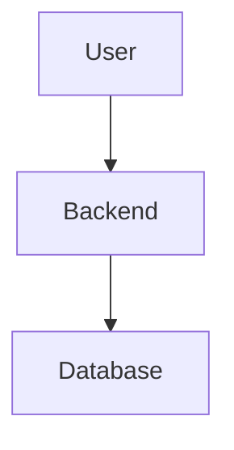
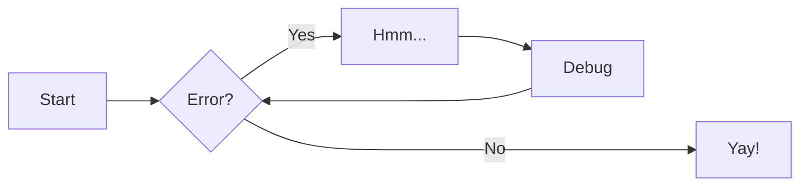

# 🧾 Markdown for MkDocs: The Complete Developer Guide

This tutorial teaches you **everything you need to know** to write Markdown for our MkDocs-based documentation 
platform, including:

* Basic markdown syntax
* Advanced formatting (tables, callouts, tabs)
* Using code blocks for YAML, JSON, bash, etc.
* Creating diagrams and admonitions
* Tips specific to **Material for MkDocs** (icons, collapsible blocks, tooltips)

[Easy in Brower Markdown Editor](https://stackedit.io)

---

## 1. 🔤 Basic Markdown

### Headings
```markdown
# H1 – Page Title
## H2 – Section Title
### H3 – Subsection
```

==How it looks==


# H1 – Page Title
## H2 – Section Title
### H3 – Subsection

### Text styles

```markdown
*italic*, **bold**, `inline code`, ~~strikethrough~~
```

==How it looks==

*italic*, **bold**, `inline code`, ~~strikethrough~~

### Lists

```markdown
- Bullet list item
  - Nested item

1. Numbered item
2. Another
```

==How it looks==


- Bullet list item
  - Nested item

1. Numbered item
2. Another

### Links and images

```markdown
[Link text](https://github.com/MindwiseLLC)

```

==How it looks==

[Link text](https://github.com/MindwiseLLC)


---

## 2. 🔧 Code Blocks

Use triple backticks with the language name:

````markdown
```python
print("Hello, world!")
```
````

Supported languages: `bash`, `python`, `yaml`, `json`, `sql`, etc.

Add titles and line numbers:
````markdown
```python title="main.py" linenums="1"
def add(x, y):
    return x + y
```
````

==How it looks==

```python
print("Hello, world!")
```

```python title="main.py" linenums="1"
def add(x, y):
    return x + y
```

---

## 3. 📊 Tables
```markdown
| Name     | Type     | Description          |
|----------|----------|----------------------|
| `name`   | `string` | The name of product  |
| `count`  | `int`    | Quantity in stock    |
```

==How it looks==

| Name     | Type     | Description          |
|----------|----------|----------------------|
| `name`   | `string` | The name of product  |
| `count`  | `int`    | Quantity in stock    |

---

## 4. 📦 Admonitions (Callouts)

Admonitions, also known as _call-outs_, are an excellent choice for including side content without significantly 
interrupting the document flow. 

Use `!!!` to highlight notes, warnings, tips, etc.

```markdown
!!! note
    This is a simple note.

!!! warning "Be careful"
    This will highlight a warning with a custom title.
```

### Supported Types:

* `note`
* `info`
* `tip`
* `success`
* `warning`
* `danger`
* `example`

You can configure icons in `mkdocs.yml`:

```yaml
theme:
  icon:
    admonition:
      note: octicons/tag-16
      tip: octicons/squirrel-16
```

==How it looks==

!!! note
    This is a simple note.

!!! warning "Be careful"
    This will highlight a warning with a custom title.

---

## 5. 🧪 Tabs and Collapsibles

### Tabs:

````markdown
=== "Python"
    ```python
    print("Hello")
    ```

=== "Bash"
    ```bash
    echo "Hello"
    ```
````

==How it looks==

=== "Python"
    ```python
    print("Hello")
    ```

=== "Bash"
    ```bash
    echo "Hello"
    ```

### Collapsible blocks:

```markdown
??? example "Click to expand"
    This content is hidden until clicked.
```

==How it looks==

??? example "Click to expand"
    This content is hidden until clicked.

---

## 6. 🧬 Diagrams with Mermaid

[Materials Tutorial on Mermaid](https://squidfunk.github.io/mkdocs-material/reference/diagrams/)
[Mermaid Official webpge and Documentation](https://mermaid.js.org)

````markdown

````
Enable with:
```` markdown
```yaml
markdown_extensions:
  - pymdownx.superfences
  - pymdownx.tabbed
  - pymdownx.details
  - pymdownx.snippets
  - pymdownx.highlight
  - attr_list
  - admonition
  - pymdownx.arithmatex
  - pymdownx.emoji
  - pymdownx.tasklist
```
````

==How it looks==


Coding Workflow



---

## 7. 🧰 Extra Tips


### Add badges


```markdown

```

==How it looks==


### Add horizontal lines

```markdown
---
```


### Add keyboard keys

```markdown
++ctrl+alt+del++
```

==How it looks==


++ctrl+alt+del++

---
