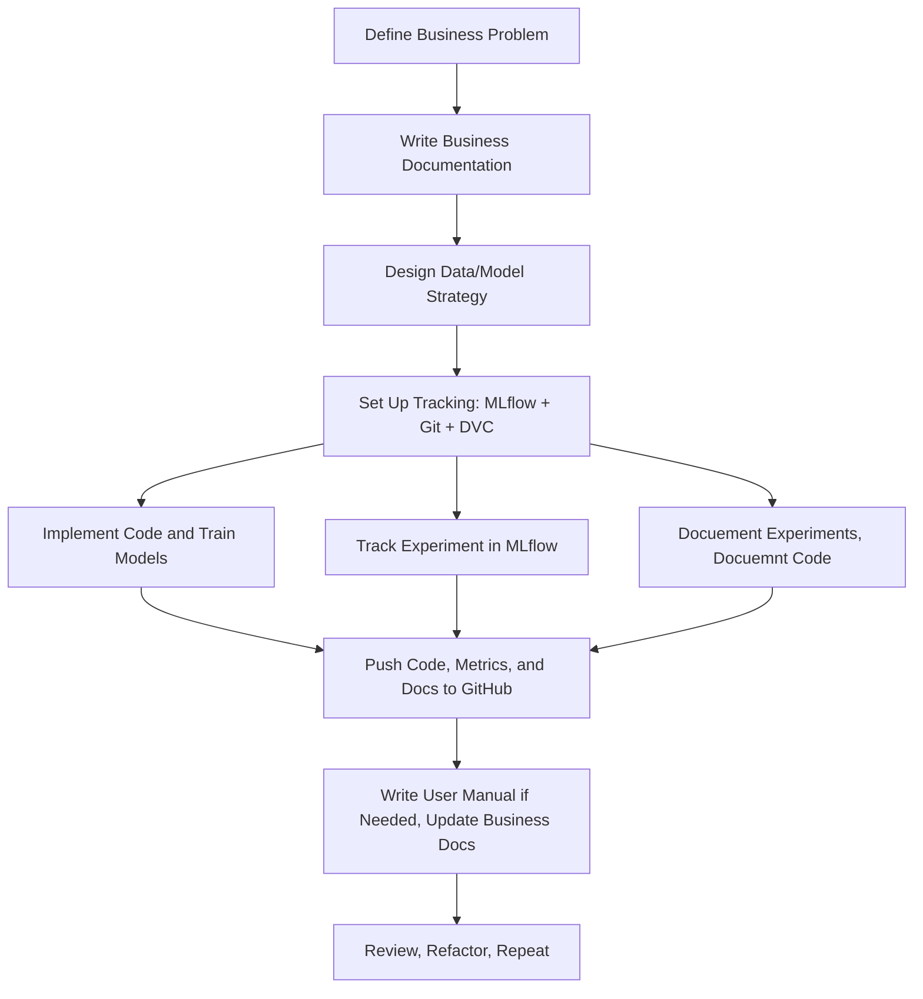

# 🚀 ML/AI Team General Workflow Guide

This guide describes **how we work as an ML/AI team** — how we plan, document, track, and version everything we do. 
Every team member must follow these principles to ensure transparency, reproducibility, and collaborative 
efficiency.

---

## 📌 Our Workflow Philosophy

We operate on three foundational principles:

1. **Document every decision and change**
2. **Track every experiment**
3. **Version everything (code, data, models)**

This ensures that any result we present can be reproduced and understood weeks or months later.

---

## 🛠️ General ML Project Workflow

---

## 🧾 What You Must Document

| Step                         | Where to Document                     |
| ---------------------------- | ------------------------------------- |
| Problem Definition           | Business Documentation                |
| Data Sources + Preprocessing | Technical Documentation               |
| Model Architecture           | Technical Documentation               |
| How to Run/Train             | User Manuals                          |
| Experiment Logs and Results  | Experiments                           |

---

## 🧪 Experiments Must Be:

* Tracked with **MLflow**
* Logged in Markdown and added to centrilized documentation
* Tagged in GitHub (e.g., `exp-2025-06-04-xgb-vs-lstm`)
* Pushed to remote as soon as an experiment finishes 
* You should have intermidary pushes as well, if the experiment takes too long, has too many code changes, and 
consists of multiple steps.

---

## 🧬 Version Control Rules

* Use Git branches: `feature/`, `experiment/`, `fix/`
* Create Git tags for major experiments
* Use DVC for versioning datasets and model binaries

---

## 📘 Documentation is Not Optional!

Every new script, major change, or result must be accompanied by a doc or edit to an existing doc.

* Add code explanations to `technical/`
* Add guides to `manuals/`
* Link all relevant Markdown pages in centrilized docuemntation hub

---

